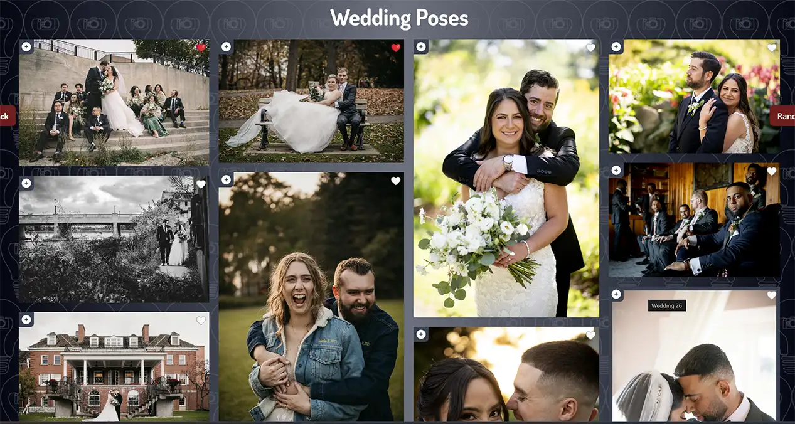

# Lightbulb - Posing Guide for Photographers

Welcome to **Lightbulb**, an innovative posing guide app designed to assist photographers in capturing the perfect shot for weddings, engagements, family portraits, and boudoir shoots. Built with Next.js, Lightbulb offers a comprehensive set of tools and inspirations to elevate your photography sessions. Lightbulb is a Progressive Web App (PWA) that can be installed on your devices for easy access.


## Built With

- **Next.js**: The React Framework for Production.
- **React**: A JavaScript library for building user interfaces.
- **Progressive Web App (PWA)**: Ensures the app can be installed on devices and used offline.
- **Netlify**: Used for deployment and hosting.
- **Yet Another React Lightbox**: Provides the lightbox for images
- **React Photo Album**: Provides the masonry grid photo album

## Features

- **Posing Categories**: Easily navigate through various categories including weddings, engagements, family portraits, and boudoir shoots.
- **Detailed Pose Descriptions**: Each pose is accompanied by a detailed description to help you understand the nuances.
- **Visual Inspirations**: High-quality images for each pose to give you a clear visual reference.
- **User-Friendly Interface**: Intuitive design ensuring smooth navigation and ease of use.
- **Favorites**: Save your favorite poses for quick access during shoots.
- **Dynamic Sessions**: Create dynamic sessions to organize your poses.
- **Offline Access**: Download poses and use the app even without an internet connection.

## Installation

To get started with Lightbulb, follow these steps:

1. **Navigate to the site**:
    ```sh
    https://lightbulb-photo.netlify.app/
    ```

2. **Follow the Install prompt on any device or use the app as a site**

## Usage

1. **Select a Category**: Choose from weddings, engagements, family portraits, or boudoir shoots.
2. **Browse Poses**: Scroll through the list of poses, each with detailed descriptions and images.
3. **Mark Favorites**: Click the heart icon to save poses for easy access later.
4. **Create Sessions**: Create sessions and add images to them for easy reference during a shoot.
5. **Offline Access**: Download poses to use them without an internet connection.




## Contributing

We welcome contributions to improve Lightbulb. If you have suggestions for new features, bug reports, or code improvements, please follow these steps:

1. Fork the repository.
2. Create a new branch (`git checkout -b feature/YourFeature`).
3. Commit your changes (`git commit -m 'Add YourFeature'`).
4. Push to the branch (`git push origin feature/YourFeature`).
5. Open a Pull Request.

## License

Lightbulb is licensed under the MIT License. See the [LICENSE](LICENSE) file for more information.

## Contact

For any questions or suggestions, please contact Saharsh Cherian at [saharsh@example.com](mailto:saharsh@example.com).

## Acknowledgments

Special thanks to all the photographers who provided invaluable feedback during the development of this app.

---

Built by Saharsh Cherian.

GitHub: [sashdc](https://github.com/sashdc)
